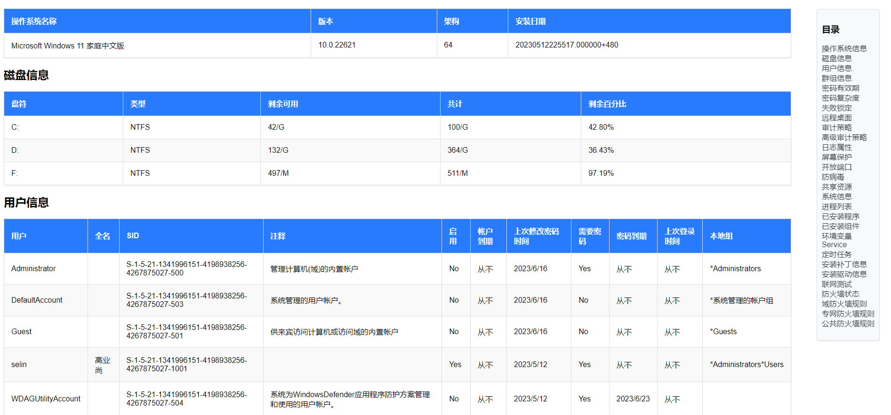

# 使用说明
> 此版本初衷是只做CLI版本,压缩体积小、跨平台可用，随着功能越多、参数越多使用人记不住参数，增加了基于Python的简易Gui版本，可满足基本增加资产、运行不同模式、运行Cli指令，增加了基于Web的多主机以及单主机不同模式的基本运行功能。注：完整使用功能建议使用Cli版本。


# 使用场景
> 弱口令检测、自动化运维、Windows基线核查、多线程Linux、MySql、Redis、PostgreSQL、Oracle、网络设备批量执行命令、等级保护（网络安全等级保护）现场测评工具、基线核查工具、测试syslog等

## web功能预览


## crack功能预览


## dirsearch功能预览


## Windows模式预览



## 自动化测评现阶段支持类型
| 序号 |      类型       | 是否支持 |     备注     |
|:--:|:-------------:|:----:|:----------:|
| 1  |    Centos     |  √   | SSH远程或本地运行 |
| 2  |    Windows    |  √   |    本地运行    |
| 3  |     Redis     |  √   |  远程或本地运行   |
| 4  |  PostgreSQL   |  √   |  远程或本地运行   |
| 5  |    Oracle     |  √   |  远程或本地运行   |
| 6  |     MSSQL     |  √   |  远程或本地运行   |
| 7  |      H3C      |  √   |   SSH远程    |
| 8  |      华为       |  √   |   SSH远程    |
| 9  |      AIX      |  √   | 可自定义命令未内置  |
| 10 |    Ubuntu     |  √   | 可自定义命令未内置  |
| 11 |    MongoDB    |      |            |
| 12 | Elasticsearch |      |            |

## 弱口令现阶段支持类型
| 序号 |      类型       | 是否支持 |       备注       |
|:--:|:-------------:|:----:|:--------------:|
| 1  |      SSH      |  √   |     支持协议识别     |
| 2  |      RDP      |  √   | 只允许在Windows下运行 |
| 3  |      FTP      |  √   |     支持协议识别     |
| 4  |     MySQL     |  √   |                |
| 5  |  PostgreSQL   |  √   |                |
| 6  |     Redis     |  √   |                |
| 7  |     MSSQL     |  √   |                |
| 8  |      SMB      |  √   |   超时参数暂时不可用    |
| 9  |    Telnet     |  √   |                |
| 10 |    Tomcat     |  √   |                |
| 11 |     xlsx      |  √   |   仅允许xlsx格式    |
| 12 |     SNMP      |      |                |
| 13 |    MangoDB    |      |                |
| 14 | Elasticsearch |      |                |

## web目录扫描现阶段支持功能
| 序号 |      功能       | 是否支持 |       备注        |
|:--:|:-------------:|:----:|:---------------:|
| 1  |      多线程      |  √   |     默认为30并发     |
| 2  |    自定义状态码     |  √   |     默认为200      |
| 3  |    自定义状态码     |  √   |     默认为200      |
| 4  |     代理模式      |  √   |  http/s、socks   |
| 5  |    返回title    |  √   |                 |
| 6  |    超时等待时常     |  √   |      默认为3秒      |
| 7  |     循环等待      |  √   |     默认为无限制      |
| 8  |     内置url     |      |                 |
| 9  | 自定义User-Agent |  √   |                 |
| 10 |      重传       |      |                 |
| 11 |      爬虫       |      |                 |
| 12 |     结果保存      |  √   | 保存到dirScan.json |


## 弱口令检测子命令
```
 Usage:
    crack [ftp、mysql、pgsql、redis、sqlserver、ssh、rdp、smb、telnet、tomcat]
    
Flags:
  -c, --chan int        并发数量 (default 30)
  -f, --fire string     此参数是指定主机列表，格式IP:Port 一行一个
  -i, --ip string       此参数是指定验证的IP 支持格式如下：192.168.0.1，或192.168.0.1/24，或192.168.0.1:22
      --noping          此参数是指定不运行ping监测
  -p, --passwd string   此参数是指定密码文件
  -P, --port int        此参数是指定暴力的端口
  -t, --time int        超时等待时常/s (default 3)
  -u, --user string     此参数是指定用户文件
```

## Web目录扫描检测子命令
```
Usage:
  golin dirsearch [flags]

Flags:
  -c, --chan int       并发数量 (default 30)
      --code string    此参数是指定状态码,多个按照,分割 (default "200")
  -f, --file string    此参数是指定读取的字典
  -h, --help           help for dirsearch
  -p, --proxy string   指定代理
  -t, --timeout int    超时等待时常/s (default 3)
  -u, --url string     指定扫描url
      --wait int       此参数是每次访问后等待多长时间
```

### web
```shell
Usage:
  golin web [flags]

Flags:
  -h, --help          help for web
  -i, --ip string     指定运行网卡ip (default "127.0.0.1")
  -p, --port string   指定运行端口 (default "1818")
  -s, --save          是否额外保存文件
```

### update
```shell
通过api.github.com进行检查更新程序

Usage:
  golin update [flags]

Flags:
  -h, --help           help for update
  -p, --proxy string   此参数是指定代理ip(仅允许http/https代理哦)
```
### gui
```shell
通过python的tk开发,实现基本的增加资产以及运行,cli功能

Usage:
  golin gui [flags]

Flags:
  -h, --help   help for gui
```

### linux

```shell
基于SSH协议远程登陆,通过多线程的方法批量进行采集

Usage:
  golin linux [flags]

Flags:
  -c, --cmd string        此参数是指定待自定义执行的命令文件
  -C, --cmdvalue string   此参数是自定义执行命令（比-c优先级高）
  -e, --echo              此参数是控制控制台是否输出结果,默认不进行输出
  -h, --help              help for linux
  -i, --ip string         此参数是指定待远程采集的IP文件位置 (default "linux.txt")
  -l, --localhost         此参数是控制本机采集的模式
  -s, --spript string     此参数是指定IP文件中的分隔字符 (default "~")
  -v, --value string      此参数是指定执行单个主机
```

### mysql

```shell
基于Mysql远程通过多线程连接执行指定sql语句并记录。(也可本地执行)

Usage:
  golin mysql [flags]

Flags:
  -c, --cmd string      此参数是自定义执行sql语句
  -e, --echo            此参数指定是控制是否输出结果
  -h, --help            help for mysql
  -i, --ip string       此参数是指定待远程采集的IP文件位置 (default "mysql.txt")
  -s, --spript string   此参数是指定IP文件中的分隔字符 (default "~")
  -v, --value string    此参数是指定执行单个主机
```

### redis

```shell
基于Redis的远程登陆功能,通过多线程进行采集,基于info字段中的值判断,写入待采集文件主机时用户名为空即可。

Usage:
  golin redis [flags]

Flags:
  -h, --help            help for redis
  -i, --ip string       此参数是指定待远程采集的IP文件位置 (default "redis.txt")
  -s, --spript string   此参数是指定IP文件中的分隔字符 (default "~")
  -v, --value string    此参数是指定执行单个设备
```
### network
```shell
运行网络相关功能,目前仅有syslog模拟器

Usage:
  golin network [flags]

Flags:
  -h, --help     help for network
  -s, --syslog   模拟syslog接收端服务器

```
### route
```shell
基于SSH的功能进行采集

Usage:
  golin route [flags]

Flags:
  -c, --cmd string        此参数是指定待自定义执行的命令文件
  -C, --cmdvalue string   此参数是自定义执行命令（比-c优先级高）
  -e, --echo              此参数是控制控制台是否输出结果,默认不进行输出
  -h, --help              help for route
  -i, --ip string         此参数是指定待远程采集的IP文件位置 (default "route.txt")
  -p, --python            此参数是指定python位置，绝对路径，如'D:\python3\python.exe'
  -s, --spript string     此参数是指定IP文件中的分隔字符 (default "~")
```
### 

### execl
```shell
通过读取xlsx文件生成golin可读取允许的格式文件

Usage:
  golin execl [flags]

Flags:
  -f, --file string     此参数是指定读取的文件
  -h, --help            help for execl
  -i, --ip string       此参数是指定ip代表的列
  -n, --name string     此参数是指定名称代表的列
  -p, --passwd string   此参数是指定密码所代表的列
  -P, --port string     此参数是指定端口代表的列
  -o, --sava string     此参数是指定保存的文件 (default "linux_xlsx.txt")
  -s, --sheet string    此参数是指定sheet名称 (default "Sheet1")
  -u, --user string     此参数是指定用户所代表的列
```
### pgsql
```
基于远程登录功能,通过多线程的方法批量进行采集(也可本地执行)
Usage:
  golin pgsql [flags]

Flags:
  -e, --echo            此参数是控制控制台是否输出结果,默认不进行输出
  -h, --help            help for pgsql
  -i, --ip string       此参数是指定待远程采集的IP文件位置 (default "pgsql.txt")
  -s, --spript string   此参数是指定IP文件中的分隔字符 (default "~")
  -v, --value string    此参数是单次执行

```
# 制作不同模式编辑启动脚本(bat)
## gui
```
@echo off
if "%1" == "h" goto begin
mshta vbscript:createobject("wscript.shell").run("%~nx0 h",0)(window.close)&&exit
:begin
golin.exe gui
```
## web
```
golin.exe web
```
## windows
```
@echo off
net session >nul 2>&1
if %errorLevel% == 0 (
    echo Running with admin privileges...
) else (
    echo Requesting admin privileges...
    :: Run this script again with admin privileges
    PowerShell -Command "Start-Process cmd.exe -Verb runAs -ArgumentList '/c %~dpnx0'"
    exit /B
)
cd /D %~dp0
start "" "golin.exe" windows
exit /B
```