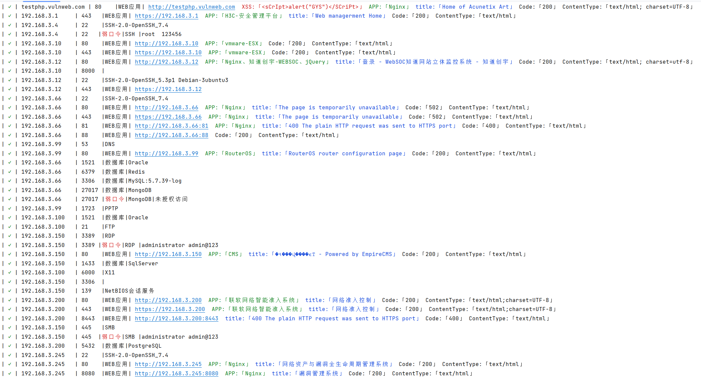
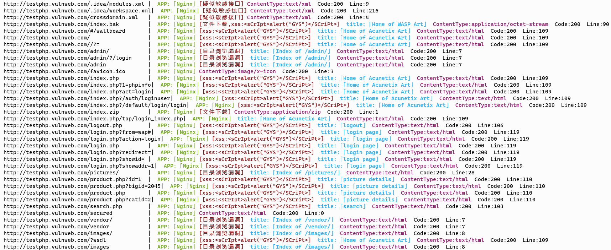

# 主要功能
> 主机存活探测、漏洞扫描、子域名扫描、端口扫描、各类服务数据库爆破、poc扫描、xss扫描、webtitle探测、web指纹识别、web敏感信息泄露、web目录浏览、web文件下载、等保安全风险问题风险自查等；
> 弱口令/未授权访问：40余种；
> WEB组件识别：300余种；
> 漏洞扫描：XSS、任意文件访问、任意命令执行、敏感信息泄露、默认账户密码...；
> 资产扫描：扫描存活主机->判断存活端口->识别协议/组件->基于组件协议进行弱口令、漏洞扫描->输出报告

## web功能预览(仅支持运行等保功能)


## 资产/组件/漏洞扫描功能预览


## WEB目录扫描功能预览


## 弱口令/未授权现阶段支持类型
| 序号 |          类型           | 是否支持 |    备注    |
|:--:|:---------------------:|:----:|:--------:|
| 1  |          SSH          |  √   |          |
| 2  |          RDP          |  √   |          |
| 3  |          FTP          |  √   |          |
| 4  |         MySQL         |  √   |          |
| 5  |      PostgreSQL       |  √   |          |
| 6  |         Redis         |  √   |          |
| 7  |         MSSQL         |  √   |          |
| 8  |          SMB          |  √   |          |
| 9  |        Telnet         |  √   |          |
| 10 |        Tomcat         |  √   |          |
| 11 |        MangoDB        |  √   | 仅验证未授权访问 |
| 12 |     Elasticsearch     |  √   | 仅验证未授权访问 |
| 13 |        oracle         |  √   |          |
| 14 |       ZooKeeper       |  √   | 仅验证未授权访问 |
| 15 |         dubbo         |  √   | 仅验证默认账户  |
| 16 |          nps          |  √   | 仅验证默认账户  |
| 17 |         Druid         |  √   | 仅验证未授权访问 |
| 18 |       activemq        |  √   | 仅验证默认账户  |
| 20 |        couchdb        |  √   | 仅验证未授权访问 |
| 21 | Hadoop-Administration |  √   | 仅验证未授权访问 |
| 22 |      ApacheSpark      |  √   | 仅验证未授权访问 |
| 23 |        swagger        |  √   | 仅验证未授权访问 |
| 24 |        Kibana         |  √   | 仅验证未授权访问 |
| 25 |     Kafka-Manager     |  √   | 仅验证未授权访问 |
| 26 |        Jenkins        |  √   | 仅验证未授权访问 |
| 27 |      Everything       |  √   | 仅验证未授权访问 |
| 28 |       D-Link路由器       |  √   | 仅验证默认账户  |
| 29 |         Nacos         |  √   | 仅验证默认账户  |
| 30 |      HiveServer       |  √   | 仅验证未授权访问 |
| 31 |    DockerRegistry     |  √   | 仅验证未授权访问 |
| 32 |      ApacheStorm      |  √   | 仅验证未授权访问 |
| 33 |      Prometheus       |  √   | 仅验证未授权访问 |
| 34 |     Node-Exporter     |  √   | 仅验证未授权访问 |
| 35 |      ApacheDruid      |  √   | 仅验证未授权访问 |
| 36 |        Zabbix         |  √   | 仅验证默认账户  |
| 37 |      JupyterLab       |  √   | 仅验证未授权访问 |
| 38 |        XXLJOB         |  √   | 仅验证默认账户  |
| 39 |    WIFISKY7层流控路由器     |  √   | 仅验证默认账户  |
| 40 |     Apache-APISIX     |  √   | 仅验证默认账户  |
| 41 |   Alibaba-Sentinel    |  √   | 仅验证默认账户  |
| 42 |     飞致云-DateEase      |  √   | 仅验证默认账户  |


## 资产扫描现阶段支持功能
| 序号 |     功能     | 是否支持 |                                           备注                                           |
|:--:|:----------:|:----:|:--------------------------------------------------------------------------------------:|
| 1  |    多线程     |  √   |                                  默认为100并发,可通过-c指定并发数                                   |
| 2  |    指定端口    |  √   |                                     格式支持1,2,3,2-20                                     |
| 3  |    指定IP    |  √   |            格式支持192.168.1.1,192.168.1.1/24,192.168.1-10,http://www.baidu.com            |
| 4  |  排除端口/主机   |  √   |                                                                                        |
| 5  | 扫描前探测主机存活  |  √   |                                基于ping,可通过--noping跳过探测存活                                |
| 6  |   打乱主机顺序   |  √   |                                 默认不打乱,可通过--random进行打乱                                  |
| 7  |    协议识别    |  √   |                    目前支持常见协议:ssh、redis、https、https、MySQL、pgsql、ftp等                     |
| 8  |    超时时间    |  √   |                                      默认5秒,可通过-t指定                                      |
| 9  |   识别web    |  √   |                                目前支持识别server、title、ssl证书                                |
| 10 |    结果保存    |  √   |                                  默认保存保存到portscan.xlsx                                  |
| 11 |  主机操作系统识别  |  √   |                                         基于ttl                                          |
| 12 |    组件识别    |  √   |                                        目前常用300+                                        |
| 13 |  自动扫描弱口令   |  √   |                    rdp、ssh、redis、mysql、oracle、es、telnet、pgsql等40+种                     |
| 14 | web自动扫描xss |  √   |                                                                                        |
| 15 | web自动扫描漏洞  |  √   |                                    扫描poc、未授权访问、目录泄露                                    |
| 16 |   快速扫描格式   |  √   | 支持格式：https://192.168.1.1:9090、http://192.168.1.1:9090、192.168.1.1:9090/login/index.php |
| 17 |  sql注入扫描   |  √   |                                                                                        |
| 18 |   fofa数据   |  √   |                          需设置fofa_email、fofa_key、fofa_size环境变量                          |

## web目录扫描现阶段支持功能
| 序号 |      功能       | 是否支持 |       备注        |
|:--:|:-------------:|:----:|:---------------:|
| 1  |      多线程      |  √   |     默认为30并发     |
| 2  |    自定义状态码     |  √   |     默认为200      |
| 3  |     代理模式      |  √   |  http/s、socks   |
| 4  |    返回title    |  √   |                 |
| 5  |    超时等待时常     |  √   |      默认为3秒      |
| 6  |     循环等待      |  √   |     默认为无限制      |
| 7  |     内置url     |  √   |       3W+       |
| 8  | 自定义User-Agent |  √   |                 |
| 9  |      重传       |      |                 |
| 10 |      爬虫       |      |                 |
| 11 |     结果保存      |  √   | 保存到dirScan.json |
| 12 |     内置字典      |  √   |     3W条目录路径     |
| 13 |    识别目录浏览     |  √   |                 |
| 14 |   识别敏感信息泄露    |  √   |                 |
| 15 |    识别文件下载     |  √   |                 |
| 16 |     xss扫描     |  √   |                 |
| 17 |     组件识别      |  √   |    目前常用300+     |

## 自动化测评现阶段支持类型
| 序号 |      类型       | 是否支持 |     备注     |
|:--:|:-------------:|:----:|:----------:|
| 1  |    Centos     |  √   | SSH远程或本地运行 |
| 2  |    Windows    |  √   |    本地运行    |
| 3  |     Redis     |  √   |  远程或本地运行   |
| 4  |  PostgreSQL   |  √   |  远程或本地运行   |
| 5  |    Oracle     |  √   |  远程或本地运行   |
| 6  |     MSSQL     |  √   |  远程或本地运行   |
| 7  |      H3C      |  √   |   SSH远程    |
| 8  |      华为       |  √   |   SSH远程    |
| 9  |      AIX      |  √   | 可自定义命令未内置  |
| 10 |    Ubuntu     |  √   | 可自定义命令未内置  |
| 11 |    MongoDB    |      |            |
| 12 | Elasticsearch |      |            |

# 常用启动参数
```
golin web (通过web方式启动,仅支持等保功能)
golin port (自动读取本地网卡IP地址段进行扫描,过滤虚拟网卡地址段)
golin port -i 192.168.1.1/24 (扫描c段端口并扫描弱口令、xss、poc漏洞)
golin port -i 192.168.1.1/24 --ipfile ip.txt (扫描指定IP段的同时扫描ip.txt文件中的主机,默认读取ip.txt,目录下如果存在不使用--ipfile也会读取)
golin port --fofa 'app="nps" && port="8080"' (调用fofa数据进行扫描)
golin port -i 192.168.1.1:8080 (快速扫描某一主机的特定端口)
golin port -i http://www.test.com:18080 (扫描网站首页)
golin port -i http://www.test.com:18080/info (扫描网站特定页)
golin port -i 192.168.1.1/24 -c 1000 -t 10(仅扫描c段端口并设置并发数为1000,端口连接超时为10秒)
golin port -i 192.168.1.1/24 --noping --nocrack --random(扫描c段端口但不探测存活不扫描弱口令,并且打乱主机顺序扫描)
golin port -i 192.168.1.1/24 --nopoc(扫描c段端口但禁用扫描漏洞)
golin dirsearch -u https://test.com -f 字典.txt --code 200,404 (扫描状态码为200以及404的web目录)
golin [linux、mysql、oracle、sqlserver、redis、windows...] (按照3级等保要求核查各项安全配置生成html形式报告)
golin update (检查是否可更新)
```

# Star Chart
[](https://starchart.cc/selinuxG/Golin)

# 免责声明
本工具仅面向合法授权的企业安全建设行为，如您需要测试本工具的可用性，请自行搭建靶机环境。

在使用本工具进行检测时，您应确保该行为符合当地的法律法规，并且已经取得了足够的授权。请勿对非授权目标进行扫描。

如您在使用本工具的过程中存在任何非法行为，您需自行承担相应一切后果。
